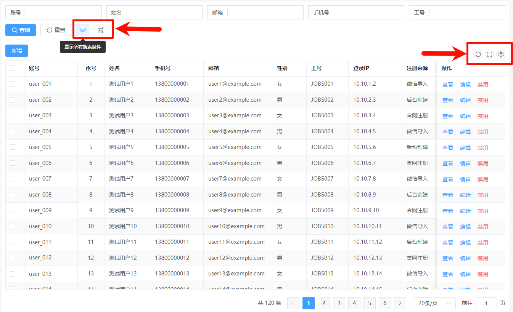
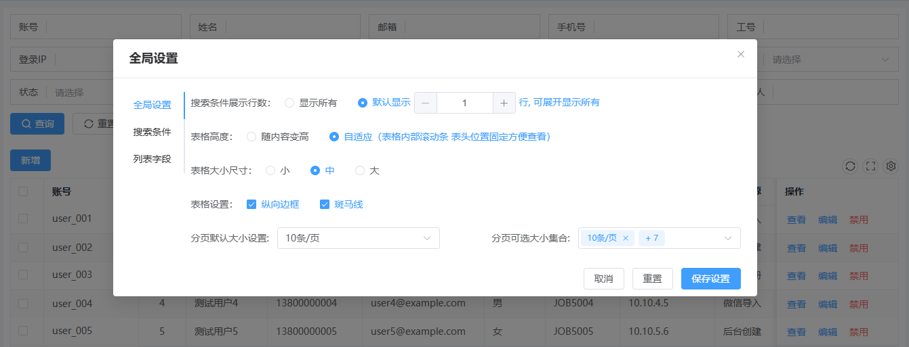
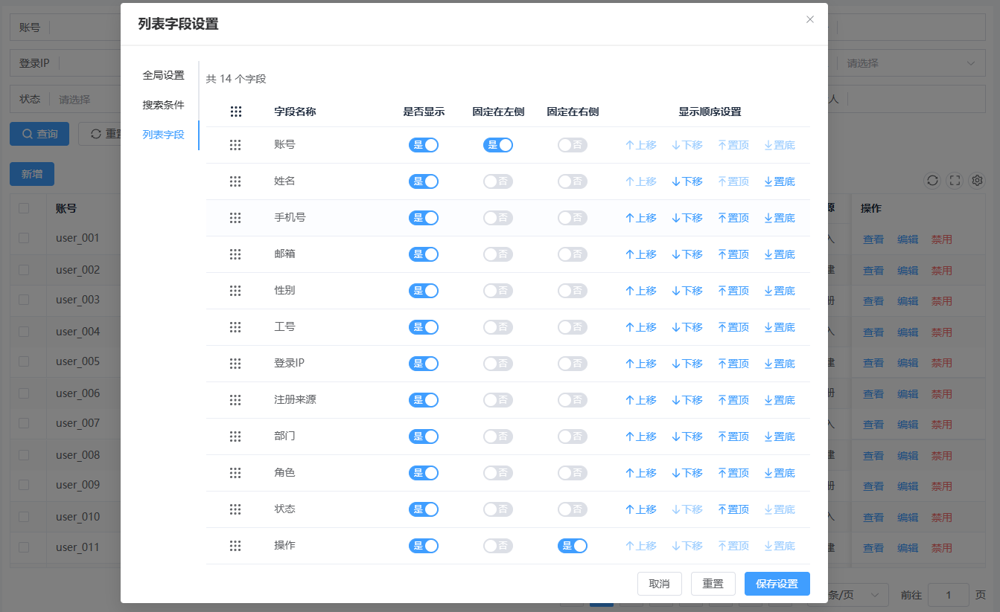

## ProTable 使用说明

`src/components/base/ProTable/src/ProTable.vue` 是一个把 **筛选区、表格、分页、全屏、列配置持久化** 组合在一起的高级表格组件。它对外的核心输入是 `filters`、`columns`、`getTableData` 和 `customId`，其中 `customId` 用来隔离每个页面的个性化配置缓存。

### 1. 组件能力概览

- 自动串联查询表单、表格和分页。
- 内置刷新、全屏、自定义列/筛选项配置。
- 支持通过 `slot` / `slotHeader` 做单元格和表头自定义渲染。
- 支持分页请求参数和返回结果的统一约定。
- 通过 `defineExpose` 暴露部分表格实例方法，便于父组件主动刷新或获取选中行。

### 2. 使用案例截图

下面 3 张截图来自仓库 `docs/` 目录，对应的是 `ProTable` 的基础列表页、全局设置、列表字段自定义三个典型场景。

| 截图 | 文件 | 重点说明 | 适用场景 |
| --- | --- | --- | --- |
| 基础列表页 | `docs/docs_1.png` | 查询区、工具栏、表格主体、分页区一体化展示 | 初次介绍 ProTable 的整体能力 |
| 全局设置弹窗 | `docs/docs_3.png` | 筛选展示、表格高度、尺寸样式、分页参数统一配置 | 说明组件级通用配置能力 |
| 列表字段设置弹窗 | `docs/docs_2.png` | 字段显隐、固定列、顺序调整、拖拽排序、保存设置 | 说明字段个性化配置与持久化 |

#### 2.1 基础列表页



这张图展示的是 `ProTable` 的标准落地形态：

- 顶部是筛选区，可组合输入框、下拉框、日期范围等查询条件。
- 中间是表格主体，支持勾选列、固定列、操作列等常见能力。
- 左上角可以通过 `table-top` 插槽扩展业务按钮，这里示例是“新增”。
- 右上角内置了刷新、全屏、自定义设置按钮。
- 底部是分页区，负责总数展示、页码切换和分页大小切换。

#### 2.2 全局设置弹窗



这张图重点说明 `ProTable` 内置了全局行为配置：

- 可以调整筛选区默认展示行数，以及是否允许展开显示全部筛选项。
- 可以切换表格高度模式，例如“随内容增高”或“自适应高度”。
- 可以统一设置表格尺寸、纵向边框、斑马纹等视觉参数。
- 可以统一设置分页默认大小和可选分页项。

这一部分适合放到“组件级通用偏好配置”场景里使用，尤其是同一类后台列表页需要统一交互体验时。

#### 2.3 列表字段设置弹窗



这张图展示的是列表字段自定义能力：

- 支持字段显隐切换。
- 支持字段固定到左侧或右侧。
- 支持字段顺序上移、下移、置顶、置底。
- 支持拖拽排序。
- 支持取消、重置、保存设置。

这也是 `customId` 最直接的使用价值之一：不同页面可以保存各自独立的字段配置，不会互相污染。

### 3. 基础用法

仓库里现有的真实接入示例在 `src/views/table-test.vue`，最小使用方式如下：

```vue
<template>
  <ProTable
    row-key="userId"
    :filters="filters"
    :columns="columns"
    :get-table-data="getData"
    custom-id="user-table"
  >
    <template #table-top>
      <el-button type="primary">新增</el-button>
    </template>

    <template #column_operate="{ row }">
      <el-button link type="primary">查看</el-button>
      <el-button link type="primary">编辑</el-button>
      <el-button link type="danger">禁用</el-button>
    </template>
  </ProTable>
</template>

<script setup lang="ts">
import { ProTable, type FilterItem, type TableColumnItem, type PageResponse } from '@/components/base/ProTable'

const filters: FilterItem[] = [
  { label: '账号', prop: 'username' },
  { type: 'select', label: '状态', prop: 'status', enumItems: [
    { label: '启用', value: 1 },
    { label: '禁用', value: 0 },
  ] },
  { type: 'datetimerange', label: '创建时间', prop: ['createTimeStart', 'createTimeEnd'] },
]

const columns: TableColumnItem[] = [
  { type: 'selection', width: 50 },
  { type: 'index', label: '序号', width: 70 },
  { label: '账号', prop: 'username', minWidth: 140, fixed: 'left' },
  { label: '状态', prop: 'status', width: 100 },
  { label: '操作', slot: 'column_operate', fixed: 'right', width: 180 },
]

const getData = async (params): Promise<PageResponse<any>> => {
  return {
    root: [],
    totalRows: 0,
  }
}
</script>
```

### 4. 数据请求与返回格式

`getTableData` 会收到筛选参数与分页参数合并后的对象。分页字段名在类型文件里已经固定：

```ts
pageNum
pageSize
```

返回值需要满足 `PageResponse<T>`：

```ts
{
  root: T[]
  totalRows: number
}
```

也就是说，最常见的接入方式是：

```ts
const getData = async (params): Promise<PageResponse<UserItem>> => {
  const res = await api(params)
  return {
    root: res.list,
    totalRows: res.total,
  }
}
```

### 5. Props

| Prop | 类型 | 必填 | 默认值 | 说明 |
| --- | --- | --- | --- | --- |
| `filters` | `FilterItem[]` | 否 | `[]` | 查询区域配置。 |
| `columns` | `TableColumnItem[]` | 否 | `[]` | 表格列配置。 |
| `getTableData` | `(params) => PageResponse \| Promise<PageResponse>` | 是 | - | 表格数据获取方法。 |
| `customId` | `string` | 建议传 | - | 自定义配置缓存标识，建议每个页面唯一；运行时未传时会回退到当前 `route.path`。 |
| `filterCustom` | `boolean` | 否 | `true` | 是否开启筛选项自定义配置入口。 |
| `isPage` | `boolean` | 否 | `true` | 是否显示分页。 |
| `autoMaxHeight` | `boolean` | 否 | 读取全局配置 | 是否自动计算表格最大高度。 |
| `drag` | `VueDraggableProps` | 否 | - | 拖拽相关配置，供内部表格拖拽能力使用。 |

> `ProTable` 还会把外部传入的多数 `el-table` 属性透传给内部 `Table` 组件，例如 `row-key`、`border`、`highlight-current-row` 等，所以日常用法里可以像普通 `el-table` 一样继续传参。

### 6. FilterItem 常用字段

`filters` 中每一项的类型是 `FilterItem`，最常用字段如下：

| 字段 | 类型 | 说明 |
| --- | --- | --- |
| `type` | `'input' \| 'input-number' \| 'select' \| 'cascader' \| 日期类型` | 控件类型，不传时默认 `input`。 |
| `label` | `string` | 表单标题。 |
| `prop` | `string \| string[]` | 字段名；日期范围类型必须传长度为 2 的数组。 |
| `visible` | `boolean` | 是否显示该筛选项。 |
| `dateFormat` | `dateFormatType` | 日期格式化输出。 |
| `enumItems` | `EnumItem[]` | `select` / `cascader` 的枚举项。 |
| `getSelectEnumItems` | `(searchKey) => EnumItem[] \| Promise<EnumItem[]>` | 远程搜索下拉选项。 |
| `slot` | `string` | 自定义筛选项插槽名。 |
| `defaultShortcut` | `ShortcutType` | 日期范围默认快捷值。 |

### 7. TableColumnItem 常用字段

`columns` 中每一项的类型是 `TableColumnItem`，最常用字段如下：

| 字段 | 类型 | 说明 |
| --- | --- | --- |
| `type` | `'index' \| 'selection' \| 'expand' \| 'drag' \| 'image'` | 列类型。 |
| `label` | `string` | 列标题。 |
| `prop` | `string \| ((row) => any)` | 字段来源。 |
| `visible` | `boolean` | 是否显示该列。 |
| `align` | `'left' \| 'center' \| 'right'` | 对齐方式。 |
| `fixed` | `'left' \| 'right' \| true \| false` | 固定列。 |
| `slot` | `string` | 单元格插槽名。 |
| `slotHeader` | `string` | 表头插槽名。 |
| `dateFormat` | `dateFormatType` | 日期展示格式。 |
| `enumItems` | `EnumItem[]` | 枚举值映射。 |
| `tagTypeMap` | `TagMapType` | 枚举值对应的标签颜色。 |
| `children` | `TableColumnItem[]` | 多级表头。 |

### 8. Slots

`ProTable` 除了固定插槽外，还会把筛选项插槽、列插槽、表头插槽透传出来。

| 插槽名 | 来源 | 作用域参数 | 说明 |
| --- | --- | --- | --- |
| `table-top` | `ProTable.vue` | 无 | 表格顶部左侧工具栏。 |
| `table-bottom` | `ProTable.vue` | 无 | 表格底部左侧区域，位于分页左边。 |
| `FilterItem.slot` 对应名称 | `Filter.vue` | `{ form, prop, value, bind }` | 自定义筛选项渲染。 |
| `TableColumnItem.slot` 对应名称 | `TableColumn.vue` | `{ row, column, cellValue, index }` | 自定义单元格渲染。 |
| `TableColumnItem.slotHeader` 对应名称 | `TableColumn.vue` | `{ row: null, column, cellValue: null, index }` | 自定义表头渲染。 |

示例：

```vue
<template #column_operate="{ row }">
  <el-button link type="primary">查看 {{ row.username }}</el-button>
</template>
```

### 9. Events

`ProTable` 当前对外透出的自定义事件只有一个：

| 事件名 | 说明 |
| --- | --- |
| `filter-reset` | 点击筛选区“重置”后触发。 |

### 10. Exposed Methods

组件通过 `defineExpose` 暴露了一组实例方法，通常配合 `ref` 使用：

```vue
<script setup lang="ts">
import { ref } from 'vue'
import { ProTable } from '@/components/base/ProTable'

const tableRef = ref<InstanceType<typeof ProTable>>()

const refresh = () => {
  tableRef.value?.refreshData()
}
</script>
```

| 方法名 | 说明 |
| --- | --- |
| `getQueryParam()` | 获取当前筛选参数。 |
| `refreshData()` | 重新请求当前表格数据。 |
| `clearSelection()` | 透传 Element Plus 表格方法。 |
| `getSelectionRows()` | 获取当前选中行。 |
| `doLayout()` | 重新计算表格布局。 |
| `getSelectionRowIds(rowKey)` | 获取当前选中行对应的主键数组。 |
| `toggleRowSelection()` | 切换某一行选中状态。 |
| `toggleAllSelection()` | 切换全选状态。 |
| `toggleRowExpansion()` | 切换展开行状态。 |
| `setCurrentRow()` | 设置当前高亮行。 |

### 11. 仓库内完整示例要点

`src/views/table-test.vue` 展示了比较完整的一套配置方式，可以直接参考：

- `filters` 同时覆盖文本输入、枚举下拉、日期范围。
- `columns` 同时覆盖多选列、序号列、固定列、日期格式化列、操作列插槽。
- `custom-id="pro-table-test2"` 用于保存当前页面的个性化配置。
- `#table-top` 适合放“新增”“批量操作”等按钮。
- `slot: 'column_operate'` + `#column_operate` 是最常见的操作列写法。

如果你准备把它接到真实接口，建议先保证接口能适配下面这个返回结构，再逐步补充筛选项和列配置：

```ts
type PageResponse<T> = {
  root: T[]
  totalRows: number
}
```
